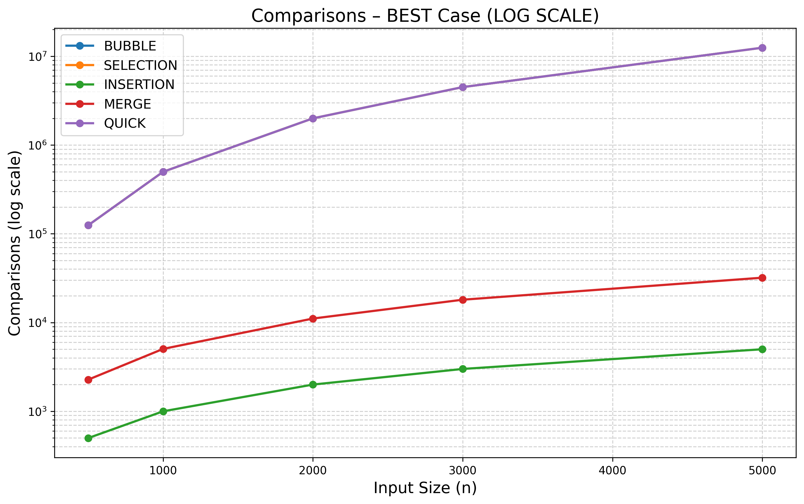
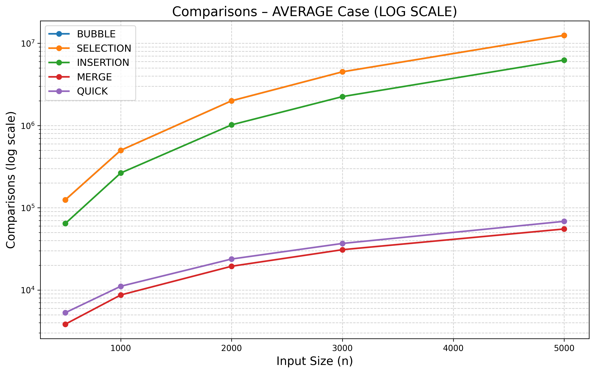
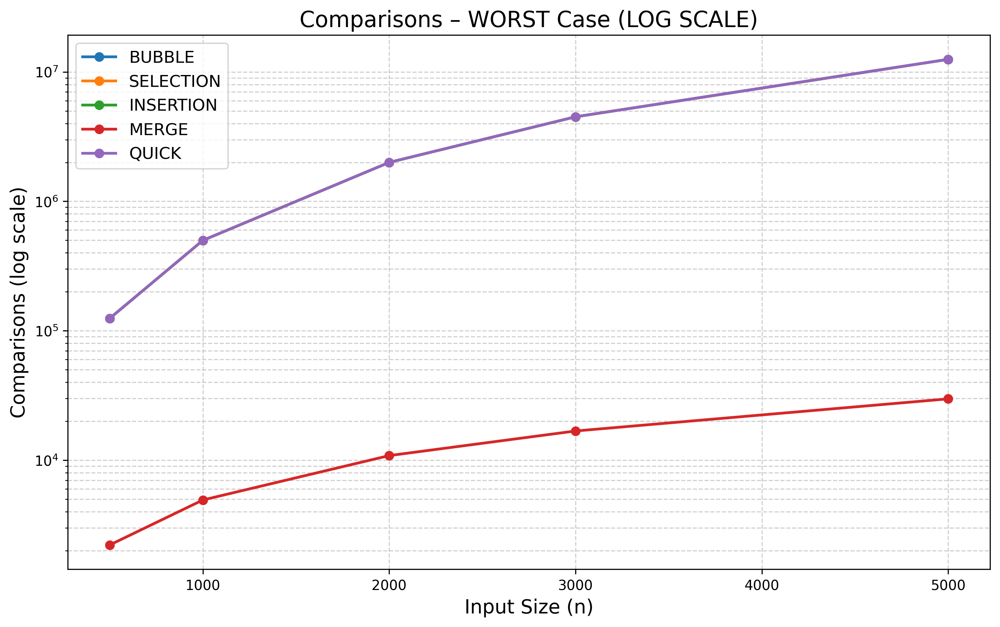

# Benchmarking Sorting Algorithms

This project benchmarks five classic sorting algorithms:

- Bubble Sort
- Selection Sort
- Insertion Sort
- Merge Sort
- Quick Sort

The program measures the **number of comparisons**, **number of swaps**, and **execution time (in microseconds)** for each algorithm in **best**, **average**, and **worst** case input scenarios across multiple input sizes.  
All results are saved into a CSV file and visualized using Python.

---

## 🚀 Getting Started

### Prerequisites
To build and run this project, you need:

- A **C++17** compatible compiler (e.g., g++ / MinGW)
- **Python 3** installed
- Python dependencies:
  ```bash
  pip install pandas matplotlib

---
## 🛠 Building and Running

### 1. Clone the repository
```bash
git clone https://github.com/<your-username>/sorting-benchmark.git
cd sorting-benchmark
```
---
### 2. Build and run the benchmark
#### Using g++: 
```bash
  g++ src/main.cpp src/utils.cpp src/bubble.cpp src/selection.cpp src/insertion.cpp src/merge.cpp src/quick.cpp -I include -o main
./main
```
#### This will automatically generate:
```bash
results/results.csv
```
### 3. Generate performance plots
```bash
cd plot
python plot_graphs.py
```
#### This will output:
```bash
results/best_case_log.png
results/average_case_log.png
results/worst_case_log.png
```
#### Log-scale graphs help clearly visualize differences between O(n), O(n log n), and O(n²) algorithms.
---

### 📊 Output Format
#### The program writes results to:
```bash
results/results.csv
```
Example:
```bash
SIZE,CASE,ALGORITHM,COMPARISONS,SWAPS,TIME(us)

500,BEST,BUBBLE,124750,0,1412
500,BEST,SELECTION,124750,0,985
500,BEST,INSERTION,499,0,0
...
```
#### Meaning of Each Column
  - SIZE → Number of elements sorted
  - CASE → BEST / AVERAGE / WORST
  - ALGORITHM → Sorting algorithm used
  - COMPARISONS → Total comparison operations
  - SWAPS → Number of swap operations
  - TIME(us) → Time taken in microseconds
---
## 📈 Performance Plots
The plotting script generates log-scale graphs, making differences between algorithm complexities clearly visible.
### Best Case


### Average Case


### Worst Case


